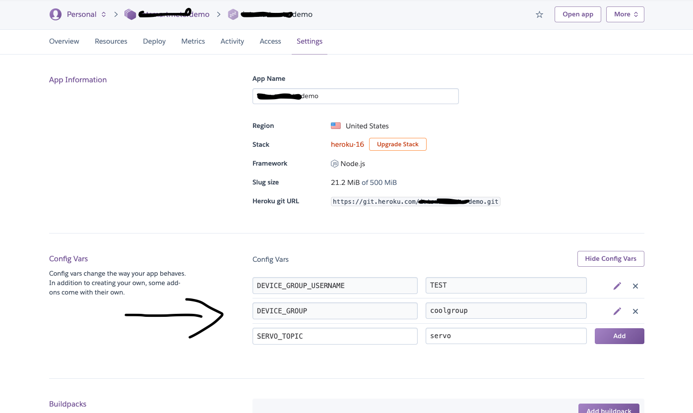
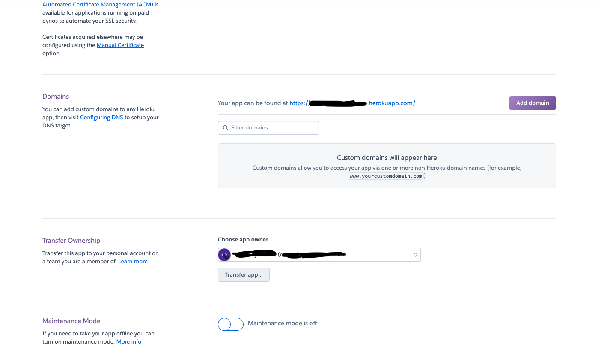
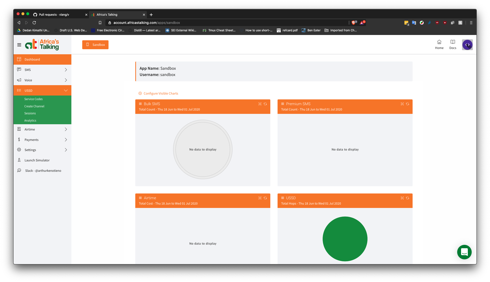
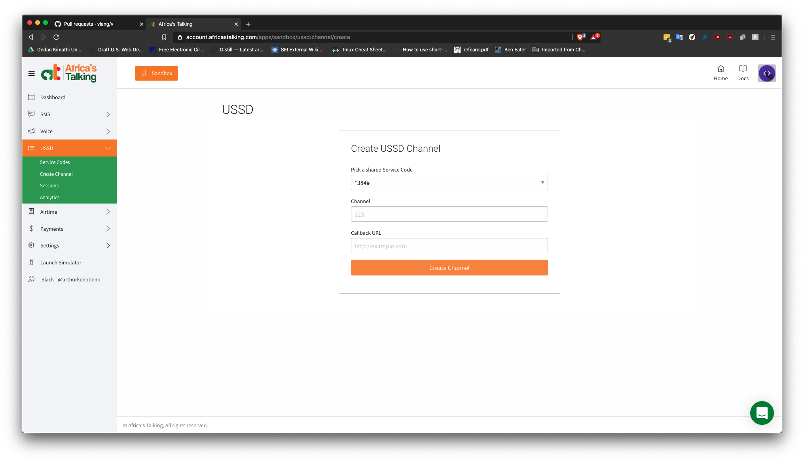
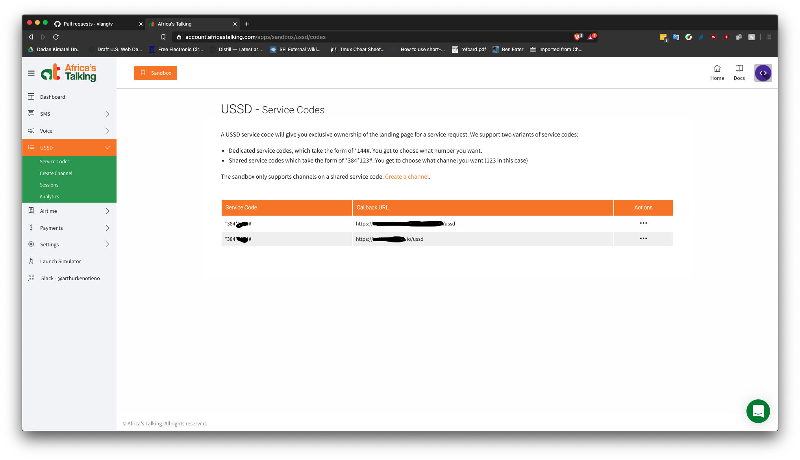
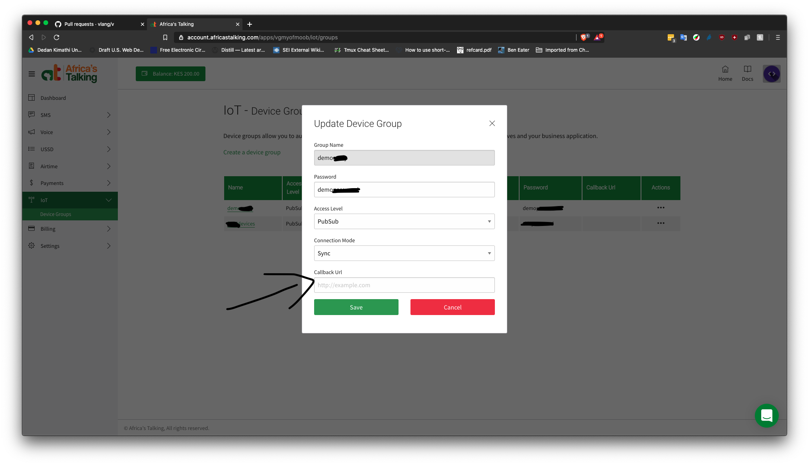
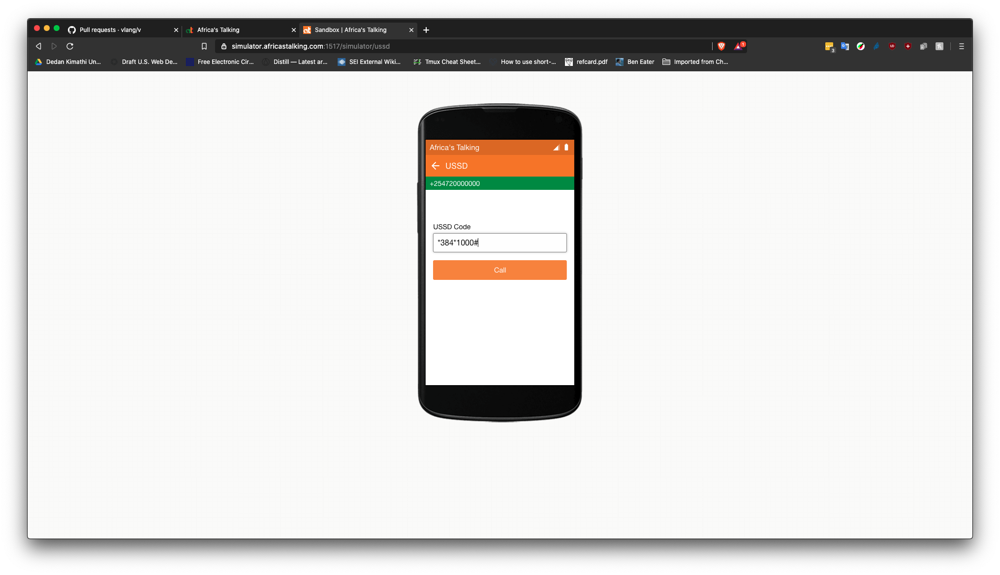

# Africa's Talking IoT : Kitchen sink Demo

## Usage

### Quick-Deploy to Heroku 

1. [Create a free Heroku account if you do not have one](https://signup.heroku.com/) 
2. Click on  button to bootstrap the app 
3. Inside your Heroku configs for the app add the following variables (see the screen grabs below for more info):
    - `DEVICE_GROUP_USERNAME` : Your IoT Application username
    - `DEVICE_GROUP` : The device group you want to authenticate to
    - `DEVICE_PASS` : The password assigned to the device group
    - `SERVO_TOPIC` : The topic to which the IoT device is listening to for servo motor control. Example if your base topic is `coolguy/devicegroup/#` and the IoT device is listening for servo motor control command at `coolguy/devicegroup/servo` then this value should be `servo`.
    - `LED_TOPIC` : Same as above but for LED control
    - `AT_USERNAME`: [Preferrably](https://help.africastalking.com/en/articles/2249244-what-is-my-username-and-api-key) `sandbox` 
    - `AT_APIKEY` : Your sandbox [API KEY](https://help.africastalking.com/en/articles/1361037-how-do-i-generate-an-api-key)
    - `IOT_APIKEY`: Your live application [API KEY](https://help.africastalking.com/en/articles/1361037-how-do-i-generate-an-api-key) 

 
 

4. Once you have finished adding your environment variables scroll down to the `Domains` section to get your application URL. Should read `https://<appname>.herokuapp.com/`
 

### Setup Africa's Talking Account 

#### USSD (Sandbox) 

1. In your Sandbox account, navigate to the USSD blade and click on "Create Channel"
  
2. In the channel creation form, add an USSD shortcode number, and in the callback URL field add the your app URL and append `ussd`. Example if your Heroku app url in 4 above is `https://mycoolapp.herokuapp.com/` then your USSD callback should be `https://mycoolapp.herokuapp.com/ussd`. 
 
3. Save and in the end you should have something like shown on the screen grab below
 

#### IoT (Live) 

1. Inside your AT IoT account, Click on the `...` under the `Actions` tab for the  device group you'd like to configure the callback for and update the callback URL to `iot`. Example if your Heroku app url  above is `https://mycoolapp.herokuapp.com/` then your IoT callback should be `https://mycoolapp.herokuapp.com/iot`. 
 

#### The Simulator (Sandbox) 
1. Navigate to the [AT Sandbox Simulator page](https://simulator.africastalking.com:1517/). Enter a valid phone number.
2. Click on the USSD option

3. Dial your USSD code. If your short code above was 1000, dial `*384*1000#` and press the `Call` button for magic!

